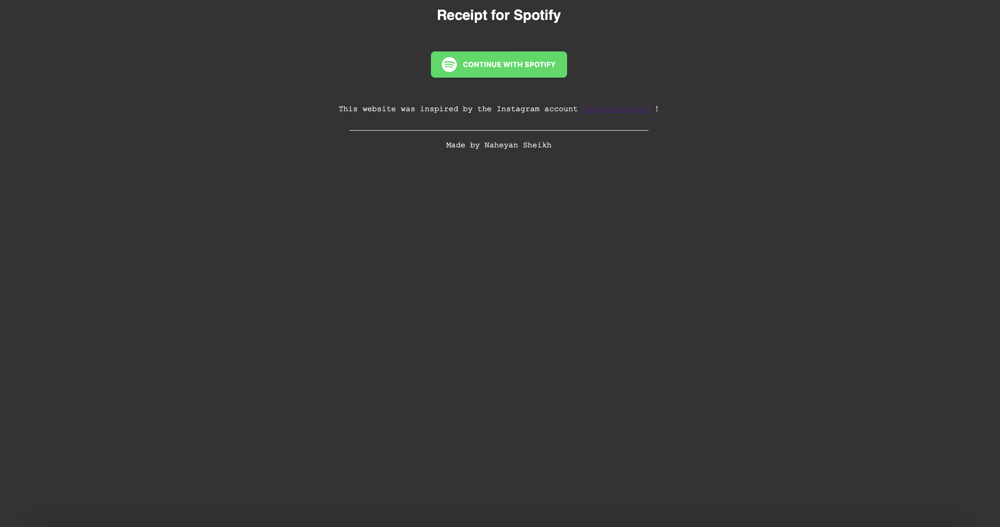
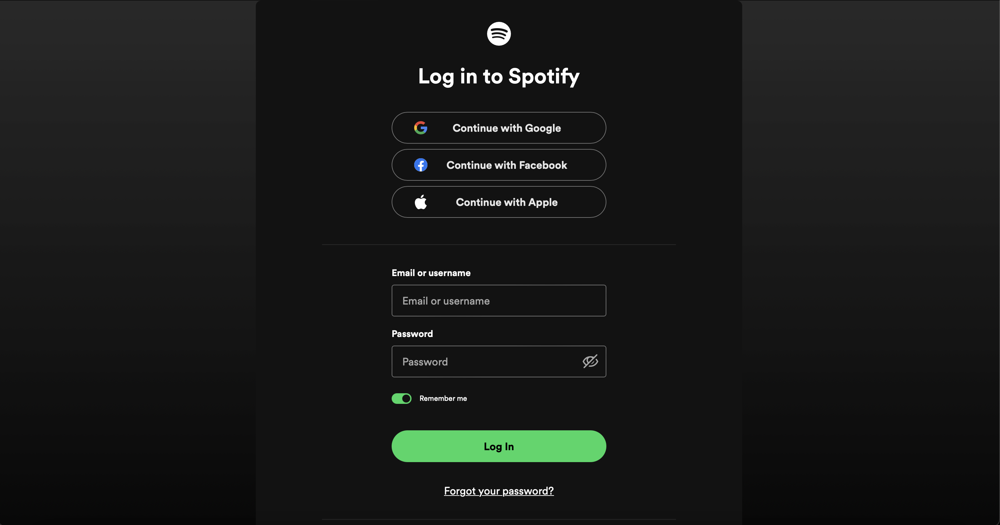
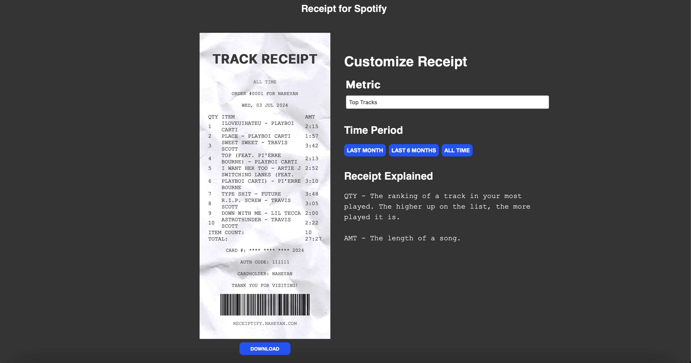
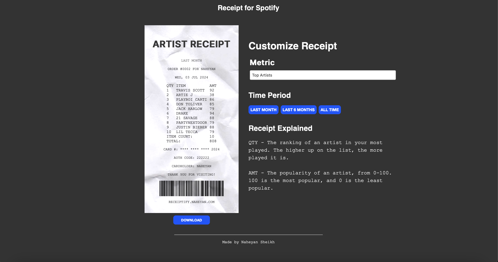

# Receiptify 🧾

## Overview
Receiptify is a web application that generates stylized receipts based on a user's Spotify listening history. It provides a unique way to visualize your favorite tracks and artists over different periods such as the last month, the last six months, or all time. The application connects with Spotify, allowing users to authenticate and fetch their listening data directly through Spotify's API.

## Glimpse
**Sign in Using Spotify:**

**Authenticate Access to Account Data:**

**View Top Tracks By Peroid:**

**View Top Artists By Peroid:**


## Features
- **Spotify Integration** 🎵: Users can log in using their Spotify account to fetch their music listening data.
- **Customizable Timeframes** ⏳: Users can generate receipts for different periods: last month, last six months, and all time.
- **Downloadable Receipts** 📥: Users can download their receipts as images to share on social media or keep as a memento.

## Inspired By
This project is inspired by [albumreceipts](https://www.instagram.com/albumreceipts/), an Instagram account that creates visual representations of music albums as shopping receipts.

## Prerequisites
Before you begin, ensure you have met the following requirements:
- You have a `Python` installation (version 3.6 or above) 🐍.
- You have installed `Flask` and other necessary Python libraries 📦.
- You have a Spotify Developer account and have set up an application to obtain the `client_id` and `client_secret` 🔑.

## Setup and Installation
1. **Clone the Repository**
   ```bash
   git clone https://github.com/naheyansheikh/receiptify.git
   cd receiptify
2. **Install Dependencies**
   ```bash
   pip install -r requirements.txt
3. **Environment Variables**
    Create a `.env` file in the project root and add the following:
   ```bash
   SPOTIFY_CLIENT_ID='your_spotify_client_id'
   SPOTIFY_CLIENT_SECRET='your_spotify_client_secret'
4. **Run the Application🚀**
   ```bash
    flask run
5. **Local Host**
    This will start the server on http://localhost:5000.

## Usage
Navigate to http://localhost:5000 in your web browser. Click on the 'Spotify Login' button and authenticate with your Spotify credentials. Once logged in, select the timeframe for which you want to generate a receipt and click on the corresponding button.

## Contact
Naheyan Sheikh - naheyans1@gmail.com
Project Link: [https://github.com/naheyansheikh/receiptify](https://github.com/naheyansheikh/receiptify)
